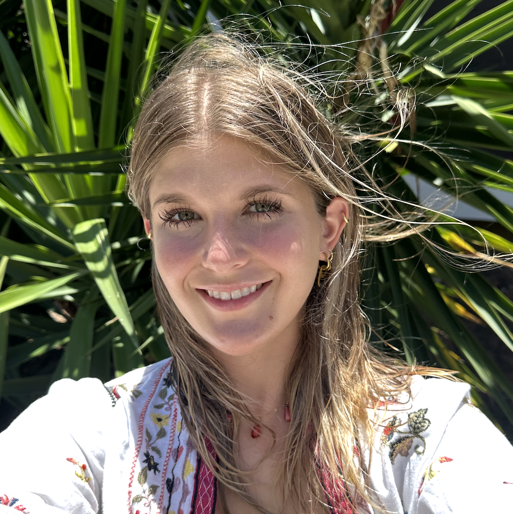

## Lucas Dion (he/him) — President

Lucas is an undergraduate student in his third year at WPI and is pursuing a degree in robotics
engineering. He is a member of the Teacher Prep Program and is looking to teach high school
technology/engineering. Lucas's interests include LEGO, games, books, movies, and foraging.

**Fun fact:** Lucas gave a TED Talk in his senior year of high school.

---

## Sarah Roberge (she/her) — Secretary

Sarah is an undergraduate Biomedical Engineering major (class of 2026). She is in the Teacher Prep
Program as well, getting her license to teach high school math. Sarah's hobbies include cooking,
baking, running, and puzzles.

**Fun fact:** Sarah is from Texas.

---

## Sol Giesso (she/her)

Sol is a master's student in WPI's Community Climate Adaptation program. She is passionate about
teaching environmental science to high schoolers and college students. Sol was the 2023 recipient of
the Projects for Peace grant, with which she
[led and taught an environmental science summer program for immigrant youth in Miami](https://global-lab.wpi.edu/empowering-immigrant-voices-in-the-fight-for-the-environment-project-for-peace).
Her other interests include art, traveling, and dogs.

**Fun fact:** Sol spent a semester researching climate change in the U.S. Virgin Islands.

---

## Wilson Gramer (he/him) — Webmaster

Wilson is a Computer Science and Learning Sciences & Technologies student at WPI with a passion for
STEM education. He has been developing [Wipple](https://www.wipple.org), an educational coding
language and platform for learning computer science, since high school and plans to work in
educational technology upon graduation. Wilson also works on multimedia development with the
[Multiverse Concert Series](https://www.multiverseseries.org), including performances of Mars
Symphony, Black Hole Symphony, and Climate Hope Concert. In his free time, Wilson enjoys running and
playing the piano.

**Fun fact:** Wilson attended the COP28 climate change conference in Dubai.
